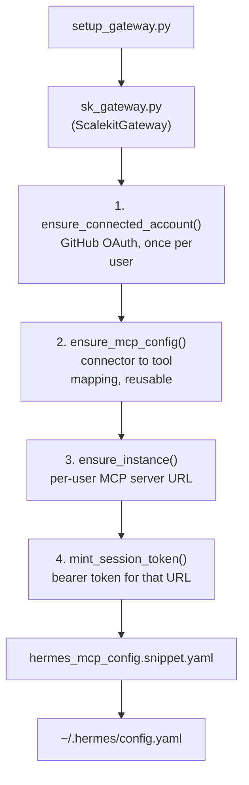

# Hermes GitHub Gateway Agent

Connects [Hermes Agent](https://github.com/NousResearch/hermes-agent) to real GitHub tools through a [Scalekit AgentKit](https://docs.scalekit.com/agentkit/overview/) MCP gateway, so Hermes calls tools over MCP with a short-lived, per-user session token instead of a GitHub personal access token sitting in `~/.hermes/config.yaml`.

This is a runnable setup script, not a demo shell. It calls the real `scalekit-sdk-python` `actions` / `actions.mcp` API, provisions a connected account, an MCP config, a per-user MCP instance, and a session token, then writes a ready-to-paste Hermes config block.

## How it fits together



Hermes ends up with **one** `mcp_servers` entry. No GitHub token is ever written to Hermes's config, only a Scalekit session token that expires and gets re-minted by re-running this script.

## Requirements

- Python 3.10+
- A Scalekit account with a GitHub connection already created (Dashboard → Connections → GitHub)
- [Hermes Agent](https://pypi.org/project/hermes-agent/) (`pip install hermes-agent`)

## Setup

```bash
cd hermes-github-gateway-agent
python3 -m venv .venv && source .venv/bin/activate
pip install -r requirements.txt
pip install hermes-agent

cp .env.example .env
# fill in SCALEKIT_ENV_URL, SCALEKIT_CLIENT_ID, SCALEKIT_CLIENT_SECRET,
# and SCALEKIT_GITHUB_CONNECTION (the connection name from your dashboard)
```

> **Known dependency conflict, `pip install hermes-agent` only:** installing `hermes-agent` alongside `scalekit-sdk-python` in the same environment can pull in `mcp` v2.x, which drops a function name (`streamablehttp_client`) that Hermes's HTTP-transport check on PyPI's `hermes-agent` 0.19.0 still looks for. If `hermes mcp test` fails with `mcp.client.streamable_http is not available`, pin an older `mcp` release that still exports both names:
> ```bash
> pip install "mcp==1.29.1"
> ```
> This was confirmed against a live Scalekit account: `hermes mcp test` failed with `mcp` v2.1.1 and succeeded immediately after downgrading to v1.29.1.
>
> **This bug is already fixed upstream, just not yet re-released to PyPI.** `npm install hermes-agent` fetches the current source directly (confirmed on version 0.21.0 / commit `29112be`) and works correctly with `mcp==2.0.0` out of the box, no pin needed. If you'd rather avoid the pin entirely, install Hermes via `npm install hermes-agent` instead of `pip install hermes-agent`.

> **If `hermes` isn't found even with the venv active:** this usually means a Conda environment (often `base`, auto-activated by your shell's startup script) is ahead of `.venv/bin` on `PATH`, even though the prompt shows `(.venv)`. Confirm with `which python3`: if it points to a Conda path instead of `.../hermes-github-gateway-agent/.venv/bin/python3`, run `conda deactivate` before `source .venv/bin/activate`, or explicitly put the venv first: `export PATH="$(pwd)/.venv/bin:$PATH"`.

## Step-by-step walkthrough

### Step 1: Run the provisioning script

```bash
python setup_gateway.py
```

This walks through all four steps in order and prints progress as it goes:

```
[1/4] Checking connected account...
      status = PENDING_AUTH
      Open this link and approve access:

      https://your-env.scalekit.com/authorize/...

      Press Enter once you've authorized access...
```

### Step 2: Authorize GitHub access

Open the printed link, approve access, and press Enter in the terminal. This is the **only** time a human touches OAuth; from here on, the token vault handles refresh automatically. The script re-checks the connected account and continues once it's `ACTIVE`:

```
      ✓ connected account is ACTIVE

[2/4] Ensuring MCP config...
      config_id = cfg_...

[3/4] Ensuring per-user MCP instance...
      instance_url = https://your-env.scalekit.com/mcp/v2/servers/<uuid>

[4/4] Minting session token for Hermes...
      expires_at = 2026-09-03 20:00:00+00:00

Done. Hermes config written to: hermes_mcp_config.snippet.yaml
```

### Step 3: Wire it into Hermes

Paste the generated snippet into `~/.hermes/config.yaml`:

```yaml
mcp_servers:
  github_gateway:
    url: "https://your-env.scalekit.com/mcp/v2/servers/<uuid>"
    headers:
      Authorization: "Bearer <session-token>"
    tools:
      include: [github_search_issues, github_issue_labels_add, github_issue_get]
      prompts: false
      resources: false
```

Note what's absent: no `GITHUB_TOKEN`, no PAT, nothing to rotate by hand.

### Step 4: Reload and verify

```bash
hermes chat
```

Inside the session:

```
/reload-mcp
```

```bash
hermes mcp test github_gateway
```

This was run for real against a live Scalekit account, and a clean test looks like this:

```
  Testing 'github_gateway'...
  Transport: HTTP → https://hey.scalekit.dev/mcp/v2/servers/...
    Authorization: Bear***1E6Q
  ✓ Connected (4806ms)
  ✓ Tools discovered: 3

    github_issue_get          Get a single issue in a repository by its number...
    github_issue_labels_add   Add labels to an issue, appending to any existing...
    github_search_issues      Search for issues and pull requests across GitHub...
```

### Step 5: Run it

> **You:** Search open issues on `scalekit-inc/scalekit-sdk-node` for anything that looks stale or unlabeled, and label it accordingly.

Hermes calls `github_search_issues`, reads what comes back, and calls `github_issue_labels_add` on whichever issue qualifies. The credential behind that call is the session token minted in step 1, issued to the connected account you authorized once, and never written anywhere as a raw GitHub token.

> **Note on tool names:** the three tools above (`github_search_issues`, `github_issue_labels_add`, `github_issue_get`) are the real, verified tool names on Scalekit's GitHub connector, confirmed by calling `client.tools.list_tools(filter=Filter(provider="GITHUB"))` against a live account. There is no `github_repo_star` tool on this connector (only `github_repo_unstar`), so don't reach for that name if you're customizing `MCP_TOOLS`. Run the same `list_tools` query yourself before adding a new tool name to confirm it actually exists on your connector.

### Step 6: Re-run when the token expires

The session token has a TTL (`SESSION_TOKEN_TTL_HOURS` in `.env`, default 8 hours). When it expires, Hermes's tool calls will start failing auth, so just re-run:

```bash
python setup_gateway.py
```

It's idempotent: the connected account and MCP config are reused, only a fresh session token and (if needed) instance are provisioned.

## Files

| File | Purpose |
|---|---|
| `settings.py` | Environment configuration (Scalekit credentials, tool list, TTLs) |
| `sk_gateway.py` | `ScalekitGateway`, the four provisioning steps, callable independently |
| `setup_gateway.py` | CLI entrypoint that runs all four steps and writes the Hermes snippet |
| `test_gateway.py` | Tests against a mocked `ScalekitClient.actions` surface, verifying call shapes match the real SDK |

## Testing

```bash
pip install pyyaml  # only needed for the snippet-validation test
pytest test_gateway.py -v
```

8 tests cover: connected account creation/reuse (active and pending states), MCP config creation/reuse, per-user instance provisioning, session token minting, the full `provision()` flow end to end, and that the generated Hermes YAML snippet parses correctly.

## Adjusting the tool list

Edit `MCP_TOOLS` in `.env` (comma-separated) to whatever GitHub tools your Scalekit GitHub connector exposes, for example adding `create_issue` or `add_comment` for a fuller triage workflow. Re-run `setup_gateway.py` after changing it; the MCP config is looked up by name (`MCP_CONFIG_NAME`), so an existing config with the old tool list won't update itself. Delete it in the Scalekit dashboard first, or change `MCP_CONFIG_NAME` to provision a new one alongside it.

## Extending this pattern

- **A different connector:** change `SCALEKIT_GITHUB_CONNECTION` and `MCP_TOOLS` to point at any other Scalekit connector (Slack, Notion, Gmail, ...); the four-step flow is identical.
- **Multiple users:** `HERMES_USER_IDENTIFIER` is a single stable identifier for local/single-operator use. In a real deployment, pass your app's actual per-user identifier (email or user ID) into `ScalekitGateway.provision()` for each user; the connected account, instance, and session token are all scoped per-identifier already.

## Security notes

- Never commit `.env` or `hermes_mcp_config.snippet.yaml`; both are in `.gitignore`.
- Session tokens are short-lived on purpose; don't extend `SESSION_TOKEN_TTL_HOURS` indefinitely.
- `MCP_TOOLS` is the actual blast-radius control: only list tools Hermes genuinely needs.
